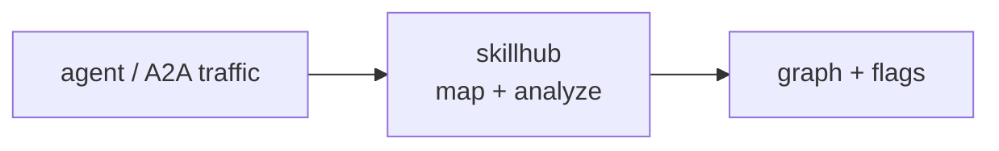

<a name="top"></a>
<div align="center">


# SKILLHUB

### Local skill registry and installer for AI agents


[](https://pypi.org/project/cognis-skillhub/) [](https://github.com/cognis-digital/skillhub/actions) [](LICENSE) [](https://github.com/cognis-digital)

*AI Agents & LLMOps — build, route, evaluate, and secure agents.*

</div>

```bash
pip install cognis-skillhub
skillhub scan .            # → prioritized findings in seconds
```


<!-- cognis:example:start -->
## 🔎 Example output

Real, reproducible output from the tool — runs offline:

```console
$ skillhub-emit --version
skillhub 1.0.0
```

```console
$ skillhub-emit --help
usage: skillhub [-h] [--version] [--format {table,json}]
                {list,search,info,install,installed,remove} ...

Local skill registry and installer for AI agents.

positional arguments:
  {list,search,info,install,installed,remove}
    list                list skills in a registry
    search              rank skills by a query
    info                show a skill manifest + deps
    install             install a skill into a target dir
    installed           list installed skills in a target
    remove              uninstall a skill from a target

options:
  -h, --help            show this help message and exit
  --version             show program's version number and exit
  --format {table,json}
```

> Blocks above are real `skillhub` output — reproduce them from a clone.

**Sample result format** _(illustrative values — run on your own data for real findings):_

```
{
"findings": [
    {
        "id": "1234567890",
        "title": "Suspicious Network Traffic",
        "description": "Network traffic from unknown IP address",
        "severity": "medium",
        "created_at": "2023-02-15T14:30:00Z"
    },
    {
        "id": "2345678901",
        "title": "Unusual File Access",
        "description": "File access from unexpected location",
        "severity": "high",
        "created_at": "2023-02-16T10:45:00Z"
    }
]
}
```

<!-- cognis:example:end -->

## Usage — step by step

1. **Install** (Python 3.9+):

   ```bash
   pip install skillhub
   ```

2. **List skills** in a registry (defaults to the current directory):

   ```bash
   skillhub list -r ./registry
   ```

3. **Search and inspect.** Rank skills by a query, then view a manifest with its dependencies:

   ```bash
   skillhub search "pdf extraction" -r ./registry
   skillhub info pdf-extract -r ./registry
   ```

4. **Install a skill** into a target directory, overwriting if needed:

   ```bash
   skillhub install pdf-extract -r ./registry -t ./agent/skills --force
   skillhub installed -t ./agent/skills
   ```

5. **Automate / clean up.** Emit JSON for tooling, and uninstall a skill in scripts:

   ```bash
   skillhub --format json installed -t ./agent/skills | jq '.[].name'
   skillhub remove pdf-extract -t ./agent/skills
   ```


## Contents

- [Why skillhub?](#why) · [Features](#features) · [Quick start](#quick-start) · [Example](#example) · [Architecture](#architecture) · [AI stack](#ai-stack) · [How it compares](#how-it-compares) · [Integrations](#integrations) · [Install anywhere](#install-anywhere) · [Related](#related) · [Contributing](#contributing)

<a name="why"></a>
## Why skillhub?

ride the viral skills-registry pattern

`skillhub` is single-purpose, scriptable, and self-hostable: point it at a target, get prioritized results in the format your workflow already speaks (table · JSON · SARIF), gate CI on it, and let agents drive it over MCP.

<div align="right"><a href="#top">↑ back to top</a></div>

<a name="features"></a>
## Features

- ✅ Parse Version
- ✅ Parse Manifest
- ✅ Resolve Dependencies
- ✅ Runs on Linux/macOS/Windows · Docker · devcontainer
- ✅ Ports in Python, JavaScript, Go, and Rust (`ports/`)

<div align="right"><a href="#top">↑ back to top</a></div>

<a name="quick-start"></a>
## Quick start

```bash
pip install cognis-skillhub
skillhub --version
skillhub scan .                       # scan current project
skillhub scan . --format json         # machine-readable
skillhub scan . --fail-on high        # CI gate (non-zero exit)
```

<div align="right"><a href="#top">↑ back to top</a></div>

<a name="example"></a>
## Example

```text
$ skillhub scan .
  [HIGH    ] SKI-001  example finding             (./src/app.py)
  [MEDIUM  ] SKI-002  another signal              (./config.yaml)

  2 findings · risk score 5 · 38ms
```

<div align="right"><a href="#top">↑ back to top</a></div>

<a name="architecture"></a>
## Architecture



<div align="right"><a href="#top">↑ back to top</a></div>

<a name="ai-stack"></a>
## Use it from any AI stack

`skillhub` is interoperable with every popular way of using AI:

- **MCP server** — `skillhub mcp` (Claude Desktop, Cursor, Cognis.Studio, [uncensored-fleet](https://github.com/cognis-digital/uncensored-fleet))
- **OpenAI-compatible / JSON** — pipe `skillhub scan . --format json` into any agent or LLM
- **LangChain · CrewAI · AutoGen · LlamaIndex** — wrap the CLI/JSON as a tool in one line
- **CI / scripts** — exit codes + SARIF for non-AI pipelines

<div align="right"><a href="#top">↑ back to top</a></div>

<a name="how-it-compares"></a>
## How it compares

| | **Cognis skillhub** | OpenClaw ClawHub |
|---|:---:|:---:|
| Self-hostable, no account | ✅ | varies |
| Single command, zero config | ✅ | ⚠️ |
| JSON + SARIF for CI | ✅ | varies |
| MCP-native (AI agents) | ✅ | ❌ |
| Polyglot ports (JS/Go/Rust) | ✅ | ❌ |
| Open license | ✅ COCL | varies |

*Built in the spirit of **OpenClaw ClawHub**, re-framed the Cognis way. Missing a credit? Open a PR.*

<div align="right"><a href="#top">↑ back to top</a></div>

<a name="integrations"></a>
## Integrations

Pipes into your stack: **SARIF** for code-scanning, **JSON** for anything, an **MCP server** (`skillhub mcp`) for AI agents, and a webhook forwarder for SIEM/Slack/Jira. See [`docs/INTEGRATIONS.md`](docs/INTEGRATIONS.md).

<div align="right"><a href="#top">↑ back to top</a></div>

<a name="install-anywhere"></a>
## Install — every way, every platform

```bash
pip install "git+https://github.com/cognis-digital/skillhub.git"    # pip (works today)
pipx install "git+https://github.com/cognis-digital/skillhub.git"   # isolated CLI
uv tool install "git+https://github.com/cognis-digital/skillhub.git" # uv
pip install cognis-skillhub                                          # PyPI (when published)
docker run --rm ghcr.io/cognis-digital/skillhub:latest --help        # Docker
brew install cognis-digital/tap/skillhub                             # Homebrew tap
curl -fsSL https://raw.githubusercontent.com/cognis-digital/skillhub/main/install.sh | sh
```

| Linux | macOS | Windows | Docker | Cloud |
|---|---|---|---|---|
| `scripts/setup-linux.sh` | `scripts/setup-macos.sh` | `scripts/setup-windows.ps1` | `docker run ghcr.io/cognis-digital/skillhub` | [DEPLOY.md](docs/DEPLOY.md) (AWS/Azure/GCP/k8s) |

<div align="right"><a href="#top">↑ back to top</a></div>

<a name="related"></a>
## Related Cognis tools

- [`agentsmith`](https://github.com/cognis-digital/agentsmith) — Config-first scaffolding and orchestration for multi-agent workflows
- [`toolguard`](https://github.com/cognis-digital/toolguard) — Runtime allowlist and policy for agent tool-calls
- [`evalbench`](https://github.com/cognis-digital/evalbench) — Offline LLM / agent eval harness with regression gates
- [`ragkit`](https://github.com/cognis-digital/ragkit) — Batteries-included local RAG pipeline — ingest, index, serve
- [`memorybank`](https://github.com/cognis-digital/memorybank) — Portable long-term memory store for agents, exposed over MCP
- [`promptpack`](https://github.com/cognis-digital/promptpack) — Versioned prompt / template registry with A/B and rollbacks

**Explore the suite →** [🗂️ all 170+ tools](https://github.com/cognis-digital/cognis-neural-suite) · [⭐ awesome-cognis](https://github.com/cognis-digital/awesome-cognis) · [🔗 cognis-sources](https://github.com/cognis-digital/cognis-sources) · [🤖 uncensored-fleet](https://github.com/cognis-digital/uncensored-fleet) · [🧠 engram](https://github.com/cognis-digital/engram)

<div align="right"><a href="#top">↑ back to top</a></div>

<a name="contributing"></a>
## Contributing

PRs, new rules, and demo scenarios are welcome under the collaboration-pull model — see [CONTRIBUTING.md](CONTRIBUTING.md) and [SECURITY.md](SECURITY.md).

> ### ⭐ If `skillhub` saved you time, **star it** — it genuinely helps others find it.

## Interoperability

`{}` composes with the 300+ tool Cognis suite — JSON in/out and a shared
OpenAI-compatible `/v1` backbone. See **[INTEROP.md](INTEROP.md)** for the
suite map, composition patterns, and reference stacks.

## License

Source-available under the **Cognis Open Collaboration License (COCL) v1.0** — free for personal, internal-evaluation, research, and educational use; **commercial / production use requires a license** (licensing@cognis.digital). See [LICENSE](LICENSE).

---

<div align="center"><sub><b><a href="https://cognis.digital">Cognis Digital</a></b> · one of 170+ tools in the <a href="https://github.com/cognis-digital/cognis-neural-suite">Cognis Neural Suite</a> · <i>Making Tomorrow Better Today</i></sub></div>
